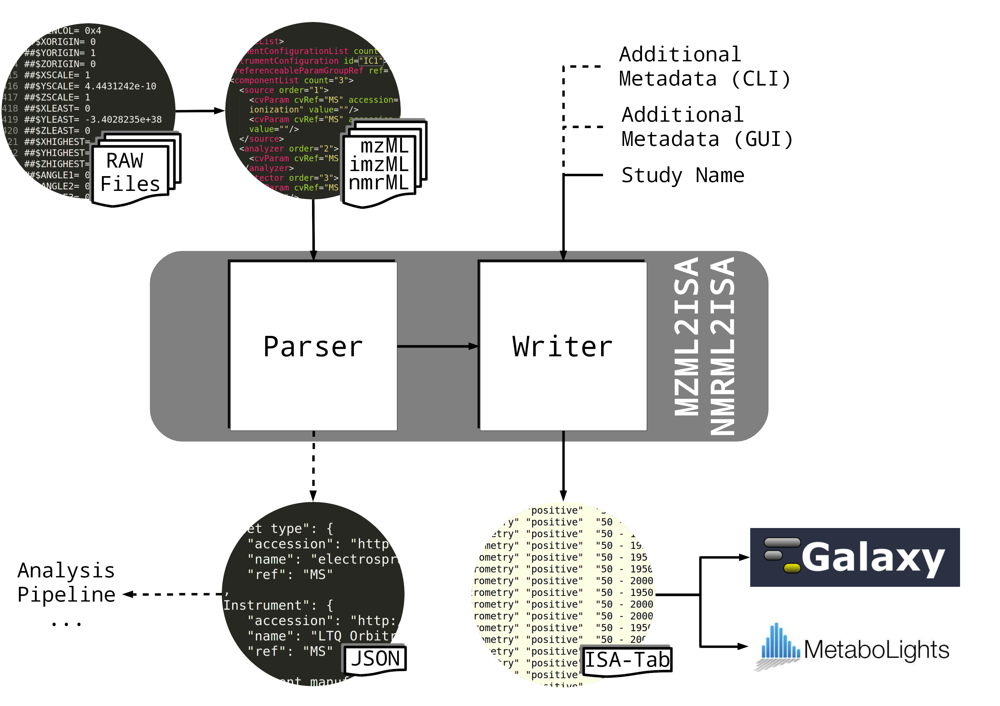

``mzml2isa``
============

Extract metadata from `mzML` and `imzML` files and write them to an ISA-Tab document.

|Version| |Py versions| |Git| |Bioconda| |Build Status (Travis)| |Build Status (AppVeyor)| |License| |RTD doc| |DOI| |Paper|

Overview
--------

mzml2isa is a Python3 program that can automatically generate ISA-Tab document
structure metadata files from raw XML metabolomics data files (mzML open access data format).
The mzml2isa tool provides the backbone of ISA-Tab metabolomics study which can
then be edited with an ISA editing tool, ISAcreator (see `MetaboLights pre-packaged
ISA Creator <http://www.ebi.ac.uk/metabolights/>`__)

**Features**:
  * Extract meta information from `mzML` files and stores it as a Python dictionary or
    serialize it into a JSON formatted document.
  * Create an ISA-Tab file structure with relevant meta information filled in.
  * Add additional metadata that cannot be parsed from mzML files to the
    ISA-Tab files through a JSON formatted dictionnary or an XLS file.

Install
-------

See the `Installation page <http://2isa.readthedocs.io/en/latest/mzml2isa/install.html>`__ of
the `online documentation <http://2isa.readthedocs.io/en/latest/mzml2isa/index.html>`__.

Usage
-----

CLI
'''

.. code:: bash

    mzml2isa -i /path/to/mzml_files/ -o /path/to/out_folder/ -s name_of_study

Python Module
'''''''''''''

See the `Usage page <http://2isa.readthedocs.io/en/latest/mzml2isa/usage.html>`__ and
the `Examples page <http://2isa.readthedocs.io/en/latest/mzml2isa/examples.html>`__ for more
information.

Metabolights
------------

To download some real data from
`MetaboLights <http://www.ebi.ac.uk/metabolights/>`__ studies to test
the converter with, run

.. code:: bash

    python scripts/metabolights-dl.py <size>

from inside the repository, where *size* is the maximum size in GiB you
can allocate to download files. The script will download the files to
the ``example_files/metabolight``\ s folder and then run mzml2isa on
those files..

If you use a \*NIX machine with **curlftpfs** and **bash** available,
you can also run

.. code:: bash

    scripts/metabolights.sh

to mount the database to the example directory and start converting mzML
studies.

Workflow
--------

.. |Build Status (Travis)| image:: https://img.shields.io/travis/computational-metabolomics/msPurity.svg?style=flat&maxAge=3600&label=Travis-CI
   :target: https://travis-ci.org/computational-metabolomics/msPurity

.. |Build Status (AppVeyor)| image:: https://img.shields.io/appveyor/ci/Tomnl/msPurity.svg?style=flat&maxAge=3600&label=AppVeyor
   :target: https://ci.appveyor.com/project/Tomnl/msPurity

.. |Git| image:: https://img.shields.io/badge/repository-GitHub-blue.svg?style=flat&maxAge=3600
   :target: https://github.com/computational-metabolomics/msPurity

.. |Bioconda| image:: https://img.shields.io/badge/install%20with-bioconda-brightgreen.svg?style=flat&maxAge=3600
   :target: http://bioconda.github.io/recipes/msPurity/README.html

.. |License| image:: https://img.shields.io/pypi/l/mzml2isa.svg?style=flat&maxAge=3600
   :target: https://www.gnu.org/licenses/gpl-3.0.html

.. |DOI| image:: https://img.shields.io/badge/DOI-10.18129/B9.bioc.msPurity-teal.svg?style=flat&maxAge=3600
   :target: https://10.18129/B9.bioc.msPurity 

.. |Paper| image:: https://img.shields.io/badge/paper-Analytical_Chemistry-teal.svg?style=flat&maxAge=3600
   :target: https://10.1021/acs.analchem.6b04358.
